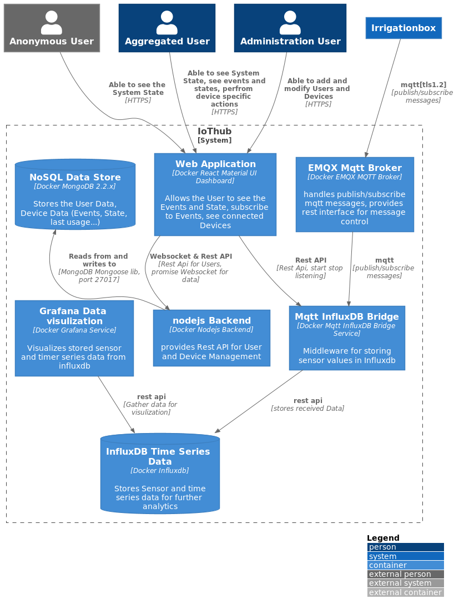

# mqttInfluxDBPusher
A mqtt client, to push received data to InfluxDB. Configureable via a Flask restful API. 

## ToDo: 
- configure via Rest Api - which database, create new database
- configure the MqttBroker and the Influxdb Connection via a Json File. 
- Save Metrics in InfluxDB
- get Metrics via RestApi
- lightweight Webinterface
